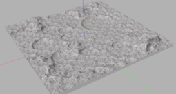
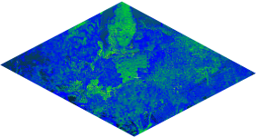

# Multimodal Deep Reinforcement Learning for UGV Navigation in Unknown Rough Terrain

## Introduction

In this study, we present a reinforcement learning based multimodal architecture for unmanned ground vehicle (UGV) navigation. The navigation system utilizes visual and LiDAR data to interact with the surrounding environment, which effectively separates perception from policy. A specialized control module is developed to comprehend UGV behavior and generate adaptable actions for navigating through challenging, unfamiliar terrains. By replacing the raw depth image with its bird's-eye view as the input and implementing a multimodal fusion scheme, our system seamlessly transitions from simulations to real-world environments. Modal separation learning and a destination-based reward modification technique are proposed to accelerate training and improve performance. A comparison study between our method, a deep learning-based method, and other deep reinforcement learning approaches revealed that our method performed better in simulation and real-world scenarios in terms of success rate, cumulative travel distance, and duration.

*Note: The code for this study will soon be open source.*

# Licence

The source code is released under [GPLv3](http://www.gnu.org/licenses/) license.